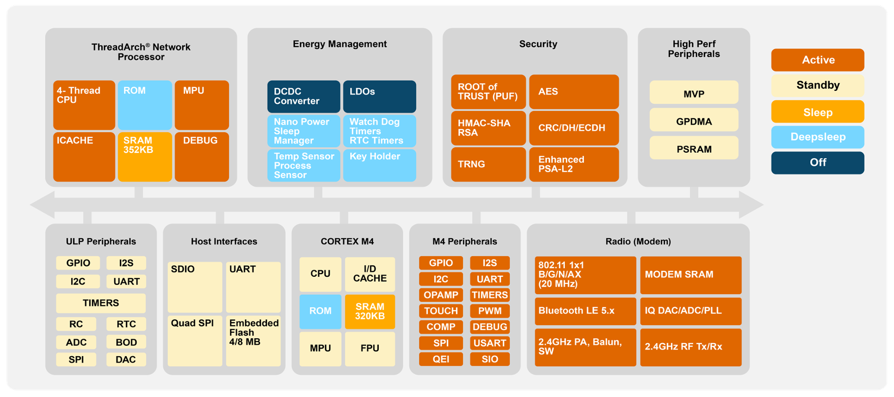
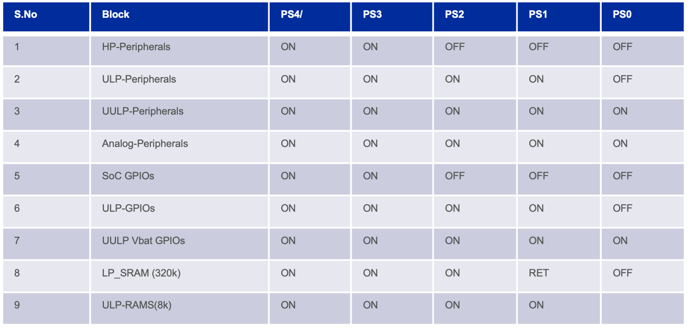

# SiWG917 architecture:

## Block Diagram:

    

SiWG917 SoC consist of two cores: 
- ThreadArch (TA) running the RF stacks
- Cortex M4 running the SoC application code

M4 Peripherals is divided in two sets:  
- high speed/ high performance ones
- Ultra Low Power (ULP) optimized ones  

 This is fundamental for the understanding of the standby/sleep modes and power levels you can achieve.
Indeed, **both cores have somehow an independant life and setting a power state on one does not necessary modify the other one**. 

This may end up getting mA overall currents while expecting uA!

The purpose of this guide is to help understand and control this to closely control power consumption.

## Power Architecture:

SiWG917 can be used in several power configurations/states. 

ThreadArch core is only under radio stack control, therefore application control it indirectly through its initialization and usage.

By oposition M4 core is totally under the application control.

M4 core and its RAM have several Power supply state (PSx). Each corresponds to core capabities and peripheral availabilities. 

Here are the Power States from the lowest power level to the highest power level:

- PS4: 
    * RAM is 1.1V (0.7V in sleep) + 32 bytes backup register array
    * CPU is 180MHz 1.1V
    * peripherals are 1.1V
    * The CPU is active and all peripherals are active.

- PS3: 
    * RAM is 1V (0.7V in sleep) + 32 bytes backup register array
    * CPU is 90MHz 1.0V
    * peripherals are 1.0V
    * The CPU is active and a limited set of peripherals are active (ULP and analog only).

- PS2: 
    * RAM is 1.0V (0.7V in sleep) + 32 bytes backup register array
    * CPU is 20MHz 0.7V or 32MHz 1.0V
    * peripherals are 1.0V
    * The CPU is active and a limited set of peripherals are active (ULP and analog only).

- PS1:  
    * RAM is 0.7V + 32 bytes backup register array
    * peripherals are 1.0V
    * The CPU is off and a limited set of peripherals are active (ULP and analog only).
    * This state can be entered from PS2 only through a Software Instruction. 
    * The peripheral interrupts are used as wakeup source or to trigger sleep once the peripheral functionality is complete.

- PS0:  
    * no RAM but 32 bytes backup register array
    * peripherals are 1.0V
    * The CPU is off and a limited set of peripherals are active (ULP only).
    * This state can be entered from PS1 only through a Software Instruction. 
    * The peripheral interrupts are used as wakeup source or to trigger sleep once the peripheral functionality is complete.

## Peripherals available vs power state:

## Power modes:

Each of the SiWG917 power states can be active, sleepy or standby. 

As this may be confusing for EFM32/EFR32 customers, we have added  EMx equivalent as well.

- Active States are available for PS2 PS3 and PS4 with their respective state limitations 
    * core is ON        
-->  **EM0**

- Standby States are available for PS2 PS3 and PS4 with their respective state limitations
   * core is OFF         
--> **EM1**

- Sleep States are available for PS2 PS3 and PS4 with their respective state limitations  
   * core is OFF     
--> **EM2**

- Shutdown State is only available in PS1 
   * core is OFF       
--> is a kind of EM1 for PS2
 
- Reset State is PS0 
   * core is OFF      
--> **EM4**

A visual view of all those modes is shown below.

 
